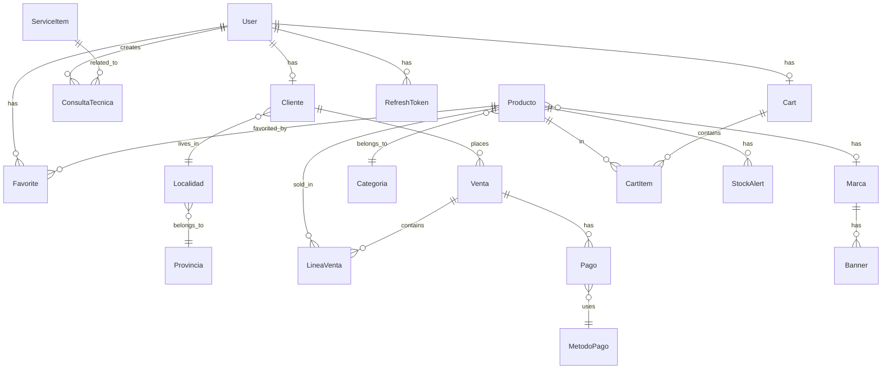

## Overview

The PC Fix database is built on **PostgreSQL** and managed through **Prisma 6**, providing type-safe database access and automatic migrations. The schema supports a full e-commerce system with users, products, shopping carts, orders, and administrative features.

<Info>
The database is hosted on Railway and includes 328 lines of carefully designed schema covering all business logic.
</Info>

## Database Technology

<CardGroup cols={2}>
  <Card title="PostgreSQL" icon="elephant">
    Production-grade relational database with ACID compliance
  </Card>
  <Card title="Prisma 6.18" icon="triangle">
    Next-generation ORM with automatic client generation
  </Card>
  <Card title="Railway Hosting" icon="cloud">
    Managed PostgreSQL with automatic backups
  </Card>
  <Card title="Prisma Studio" icon="chart-bar">
    Visual database browser on port 5555
  </Card>
</CardGroup>

## Schema Configuration

```prisma prisma/schema.prisma
generator client {
  provider      = "prisma-client-js"
  binaryTargets = ["native", "debian-openssl-3.0.x"]
}

datasource db {
  provider = "postgresql"
  url      = env("DATABASE_URL")
}
```

<Tip>
The `binaryTargets` configuration ensures compatibility with both local development and containerized deployments.
</Tip>

## Schema Overview

The database schema is organized into five main domains:

<Steps>
  <Step title="Users & Authentication">
    User accounts, roles, authentication tokens, and client profiles
  </Step>
  <Step title="Products & Catalog">
    Products, categories, brands, banners, and favorites
  </Step>
  <Step title="Shopping & Cart">
    Shopping cart, cart items, and stock alerts
  </Step>
  <Step title="Sales & Payments">
    Orders, order lines, payments, and payment methods
  </Step>
  <Step title="Technical Support">
    Support tickets, service items, and ticket responses
  </Step>
</Steps>

## User Management

### User Model

```prisma
model User {
  id        Int      @id @default(autoincrement())
  email     String   @unique
  nombre    String
  apellido  String
  telefono  String?
  password  String?
  googleId  String?  @unique
  role      Role     @default(USER)
  
  // Relations
  cliente   Cliente?
  favoritos Favorite[]
  consultas ConsultaTecnica[]
  cart      Cart?
  
  // Password reset
  resetToken        String?
  resetTokenExpires DateTime? @db.Timestamptz(3)
  
  // Refresh tokens for JWT
  refreshTokens     RefreshToken[]
  
  createdAt DateTime @default(now()) @db.Timestamptz(3)
  updatedAt DateTime @updatedAt @db.Timestamptz(3)
}

enum Role {
  USER
  ADMIN
}
```

<Note>
Users can authenticate via password or Google OAuth (`googleId` field). The `role` field enables role-based access control.
</Note>

### Client Profile

```prisma
model Cliente {
  id          Int       @id @default(autoincrement())
  userId      Int       @unique
  user        User      @relation(fields: [userId], references: [id], onDelete: Cascade)
  direccion   String?
  telefono    String?
  localidadId Int?
  localidad   Localidad? @relation(fields: [localidadId], references: [id])
  ventas      Venta[]

  @@index([userId])
  @@index([localidadId])
}
```

### Location Data

```prisma
model Localidad {
  id           Int       @id @default(autoincrement())
  nombre       String
  codigoPostal String
  provinciaId  Int
  provincia    Provincia @relation(fields: [provinciaId], references: [id])
  clientes     Cliente[]

  @@index([provinciaId])
}

model Provincia {
  id          Int       @id @default(autoincrement())
  nombre      String    @unique
  localidades Localidad[]
}
```

<Tip>
Location data supports Argentina's provincial and locality structure for shipping calculations.
</Tip>

### Refresh Tokens

```prisma
model RefreshToken {
  id          Int      @id @default(autoincrement())
  token       String   @unique
  userId      Int
  user        User     @relation(fields: [userId], references: [id], onDelete: Cascade)
  expiresAt   DateTime @db.Timestamptz(3)
  revoked     Boolean  @default(false)
  createdAt   DateTime @default(now())
  updatedAt   DateTime @updatedAt
  
  @@index([userId])
}
```

## Product Catalog

### Product Model

```prisma
model Producto {
  id             Int      @id @default(autoincrement())
  nombre         String
  descripcion    String   @db.Text
  precio         Decimal  @db.Decimal(10, 2)
  precioOriginal Decimal? @db.Decimal(10, 2)
  stock          Int
  foto           String?
  isFeatured     Boolean  @default(false)
  deletedAt      DateTime? @db.Timestamptz(3) // Soft delete
  
  // Shipping dimensions
  peso           Decimal  @default(0.5) @db.Decimal(10, 3)
  alto           Int      @default(10)
  ancho          Int      @default(10)
  profundidad    Int      @default(10)

  // Relations
  categoriaId    Int
  categoria      Categoria @relation(fields: [categoriaId], references: [id])
  marcaId        Int?
  marca          Marca?    @relation(fields: [marcaId], references: [id])
  
  favoritedBy    Favorite[]
  lineasVenta    LineaVenta[]
  cartItems      CartItem[]
  stockAlerts    StockAlert[]
  
  createdAt      DateTime @default(now())
  updatedAt      DateTime @updatedAt

  @@index([categoriaId])
  @@index([marcaId])
  @@index([isFeatured])
  @@index([deletedAt])
}
```

<AccordionGroup>
  <Accordion title="Key Features">
    - **Soft Delete**: `deletedAt` field allows marking products as deleted without removing data
    - **Pricing**: Support for original and discounted prices
    - **Shipping**: Physical dimensions and weight for shipping calculations
    - **Featured Products**: `isFeatured` flag for homepage highlights
  </Accordion>
  
  <Accordion title="Stock Alerts">
    ```prisma
    model StockAlert {
      id         Int      @id @default(autoincrement())
      email      String
      productoId Int
      producto   Producto @relation(fields: [productoId], references: [id])
      createdAt  DateTime @default(now()) @db.Timestamptz(3)
      @@unique([email, productoId])
    }
    ```
    Users can subscribe to stock alerts for out-of-stock products.
  </Accordion>
</AccordionGroup>

### Categories

```prisma
model Categoria {
  id            Int         @id @default(autoincrement())
  nombre        String      @unique
  padreId       Int?
  padre         Categoria?  @relation("CategoriaJerarquia", fields: [padreId], references: [id])
  subcategorias Categoria[] @relation("CategoriaJerarquia")
  productos     Producto[]
}
```

<Note>
Categories support hierarchical relationships (parent/child) for organizing products into nested groups.
</Note>

### Brands

```prisma
model Marca {
  id        Int      @id @default(autoincrement())
  nombre    String   @unique
  logo      String?
  productos Producto[]
  banners   Banner[]
}

model Banner {
  id        Int      @id @default(autoincrement())
  imagen    String
  marcaId   Int
  marca     Marca    @relation(fields: [marcaId], references: [id])
  createdAt DateTime @default(now()) @db.Timestamptz(3)

  @@index([marcaId])
}
```

### Favorites

```prisma
model Favorite {
  userId     Int
  user       User     @relation(fields: [userId], references: [id], onDelete: Cascade)
  productoId Int
  producto   Producto @relation(fields: [productoId], references: [id])
  @@id([userId, productoId])
}
```

<Tip>
Favorites use a composite primary key to prevent duplicate entries.
</Tip>

## Shopping Cart

```prisma
model Cart {
  id                 Int        @id @default(autoincrement())
  userId             Int        @unique
  user               User       @relation(fields: [userId], references: [id], onDelete: Cascade)
  items              CartItem[]
  abandonedEmailSent Boolean    @default(false)
  updatedAt          DateTime   @updatedAt
  createdAt          DateTime   @default(now())
}

model CartItem {
  id        Int      @id @default(autoincrement())
  cartId    Int
  cart      Cart     @relation(fields: [cartId], references: [id], onDelete: Cascade)
  productoId Int
  producto   Producto @relation(fields: [productoId], references: [id])
  quantity  Int
  
  @@index([cartId])
  @@index([productoId])
}
```

<Note>
The `abandonedEmailSent` flag tracks whether the user has received an abandoned cart email reminder.
</Note>

## Sales & Orders

### Sales Model

```prisma
model Venta {
  id                Int         @id @default(autoincrement())
  fecha             DateTime    @default(now()) @db.Timestamptz(3)
  montoTotal        Decimal     @db.Decimal(10, 2)
  estado            VentaEstado @default(PENDIENTE_PAGO)
  comprobante       String?
  
  // Logistics
  costoEnvio        Decimal     @default(0) @db.Decimal(10, 2)
  metodoEnvio       String      @default("CORREO_ARGENTINO")
  codigoSeguimiento String?
  etiquetaUrl       String?
  
  // Shipping address (for Zipnova)
  direccionEnvio    String?
  ciudadEnvio       String?
  provinciaEnvio    String?
  cpEnvio           String?
  telefonoEnvio     String?
  documentoEnvio    String?
  
  // Zipnova tracking
  zipnovaShipmentId String?
  
  // Customer choices
  tipoEntrega       String      @default("ENVIO") // 'ENVIO' | 'RETIRO'
  medioPago         String      @default("TRANSFERENCIA") // 'TRANSFERENCIA' | 'BINANCE' | 'EFECTIVO'
  tipoEnvio         String?

  // Relations
  clienteId         Int
  cliente           Cliente     @relation(fields: [clienteId], references: [id], onDelete: Cascade)
  lineasVenta       LineaVenta[]
  pagos             Pago[]

  @@index([clienteId])
  @@index([estado])
  @@index([fecha])
}

enum VentaEstado {
  PENDIENTE_PAGO
  PENDIENTE_APROBACION
  APROBADO
  ENVIADO
  ENTREGADO
  RECHAZADO
  CANCELADO
}
```

<AccordionGroup>
  <Accordion title="Order Status Workflow">
    1. **PENDIENTE_PAGO** - Order created, awaiting payment
    2. **PENDIENTE_APROBACION** - Payment submitted, awaiting admin approval
    3. **APROBADO** - Payment approved, ready to ship
    4. **ENVIADO** - Order shipped to customer
    5. **ENTREGADO** - Order delivered successfully
    6. **RECHAZADO** - Payment rejected
    7. **CANCELADO** - Order cancelled
  </Accordion>
  
  <Accordion title="Delivery Options">
    - **ENVIO**: Home delivery via shipping provider
    - **RETIRO**: In-store pickup
    
    The system supports multiple shipping providers including Correo Argentino and Zipnova.
  </Accordion>
  
  <Accordion title="Payment Methods">
    - **TRANSFERENCIA**: Bank transfer
    - **BINANCE**: Cryptocurrency (USDT)
    - **EFECTIVO**: Cash (for in-store pickup)
  </Accordion>
</AccordionGroup>

### Order Lines

```prisma
model LineaVenta {
  id         Int      @id @default(autoincrement())
  ventaId    Int
  venta      Venta    @relation(fields: [ventaId], references: [id], onDelete: Cascade)
  productoId Int
  producto   Producto @relation(fields: [productoId], references: [id])
  cantidad   Int
  subTotal   Decimal  @db.Decimal(10, 2)
  customPrice Decimal? @db.Decimal(10, 2)
  customDescription String?
  
  @@unique([ventaId, productoId])
  @@index([ventaId])
  @@index([productoId])
}
```

<Note>
Order lines support custom pricing and descriptions for special scenarios (bulk discounts, promotions, etc.).
</Note>

### Payments

```prisma
model Pago {
  id           Int        @id @default(autoincrement())
  fecha        DateTime   @default(now()) @db.Timestamptz(3)
  monto        Decimal    @db.Decimal(10, 2)
  ventaId      Int
  venta        Venta      @relation(fields: [ventaId], references: [id], onDelete: Cascade)
  metodoPagoId Int
  metodoPago   MetodoPago @relation(fields: [metodoPagoId], references: [id])

  @@index([ventaId])
  @@index([metodoPagoId])
}

model MetodoPago {
  id     Int    @id @default(autoincrement())
  nombre String @unique
  pagos  Pago[]
}
```

## System Configuration

```prisma
model Configuracion {
  id              Int     @id @default(autoincrement())
  
  // Bank details
  nombreBanco     String  @default("Banco Nación")
  titular         String  @default("PCFIX S.A.")
  cbu             String  @default("0000000000000000000000")
  alias           String  @default("PCFIX.VENTAS")
  
  // Shipping & pricing
  costoEnvioFijo  Decimal @default(5000) @db.Decimal(10, 2)
  cotizacionUsdt  Decimal @default(1150) @db.Decimal(10, 2)
  
  // Crypto payment
  binanceAlias    String? @default("PCFIX.USDT")
  binanceCbu      String? @default("PAY-ID-123456")
  
  // Store info
  direccionLocal  String? @default("Av. Corrientes 1234, CABA")
  horariosLocal   String? @default("Lun a Vie: 10 a 18hs")
  
  // Maintenance mode
  maintenanceMode Boolean @default(false)
}
```

<Tip>
The configuration table stores system-wide settings that can be updated by admins without code changes.
</Tip>

## Technical Support

```prisma
model ConsultaTecnica {
  id          Int      @id @default(autoincrement())
  asunto      String
  mensaje     String   @db.Text
  respuesta   String?  @db.Text
  estado      EstadoConsulta @default(PENDIENTE)
  userId      Int
  user        User     @relation(fields: [userId], references: [id], onDelete: Cascade)
  
  serviceItemId Int?
  serviceItem   ServiceItem? @relation(fields: [serviceItemId], references: [id])
  createdAt   DateTime @default(now())
  respondedAt DateTime? @db.Timestamptz(3)

  @@index([userId])
  @@index([estado])
  @@index([serviceItemId])
}

enum EstadoConsulta {
  PENDIENTE
  RESPONDIDO
}

model ServiceItem {
  id          Int      @id @default(autoincrement())
  title       String
  description String
  price       Int
  active      Boolean  @default(true)
  createdAt   DateTime @default(now())
  updatedAt   DateTime @updatedAt
  
  consultas   ConsultaTecnica[]
  
  @@map("service_items")
}
```

## Database Indexes

The schema includes strategic indexes for performance:

<CodeGroup>
```sql User Indexes
CREATE INDEX ON "User"("email");
CREATE INDEX ON "User"("googleId");
```

```sql Product Indexes
CREATE INDEX ON "Producto"("categoriaId");
CREATE INDEX ON "Producto"("marcaId");
CREATE INDEX ON "Producto"("isFeatured");
CREATE INDEX ON "Producto"("deletedAt");
```

```sql Sales Indexes
CREATE INDEX ON "Venta"("clienteId");
CREATE INDEX ON "Venta"("estado");
CREATE INDEX ON "Venta"("fecha");
```

```sql Cart Indexes
CREATE INDEX ON "CartItem"("cartId");
CREATE INDEX ON "CartItem"("productoId");
```
</CodeGroup>

## Prisma Migrations

### Creating Migrations

<CodeGroup>
```bash Development
# Create and apply migration
npm run db:push --workspace=api

# Or create named migration
npx prisma migrate dev --name add_user_phone
```

```bash Production
# Apply pending migrations
npx prisma migrate deploy
```
</CodeGroup>

### Database Seeding

```typescript prisma/seed.ts
import { PrismaClient } from '@prisma/client';
import bcrypt from 'bcryptjs';

const prisma = new PrismaClient();

async function main() {
  // Create admin user
  const hashedPassword = await bcrypt.hash('admin123', 10);
  const admin = await prisma.user.upsert({
    where: { email: 'admin@pcfix.com' },
    update: {},
    create: {
      email: 'admin@pcfix.com',
      nombre: 'Admin',
      apellido: 'PCFIX',
      password: hashedPassword,
      role: 'ADMIN',
    },
  });
  
  // Create categories
  const categorias = ['Procesadores', 'Placas de Video', 'Memorias RAM', 'Almacenamiento'];
  for (const nombre of categorias) {
    await prisma.categoria.upsert({
      where: { nombre },
      update: {},
      create: { nombre },
    });
  }
  
  // Create brands
  const marcas = ['Intel', 'AMD', 'NVIDIA', 'Kingston', 'Corsair'];
  for (const nombre of marcas) {
    await prisma.marca.upsert({
      where: { nombre },
      update: {},
      create: { nombre },
    });
  }
  
  console.log('✅ Database seeded successfully');
}

main()
  .catch((e) => {
    console.error(e);
    process.exit(1);
  })
  .finally(async () => {
    await prisma.$disconnect();
  });
```

<Tip>
Run seed with: `npx prisma db seed`
</Tip>

## Prisma Studio

Access the visual database browser:

```bash
npm run db:studio --workspace=api
```

Open http://localhost:5555 to:
- Browse all tables
- Create, edit, delete records
- View relationships
- Run queries

## Database Relationships



## Best Practices

<CardGroup cols={2}>
  <Card title="Use Transactions" icon="arrow-right-arrow-left">
    For operations affecting multiple tables (orders, payments)
  </Card>
  <Card title="Soft Deletes" icon="trash">
    Use `deletedAt` timestamps instead of hard deletes for products
  </Card>
  <Card title="Indexes" icon="bolt">
    Add indexes on foreign keys and frequently queried fields
  </Card>
  <Card title="Timestamps" icon="clock">
    Always use `@db.Timestamptz(3)` for timezone-aware timestamps
  </Card>
</CardGroup>

## Next Steps

<CardGroup cols={3}>
  <Card title="Backend API" icon="server" href="/architecture/backend">
    Learn how to query this schema
  </Card>
  <Card title="Migrations" icon="database" href="/development/migrations">
    Manage schema changes
  </Card>
  <Card title="Deployment" icon="rocket" href="/deployment/database">
    Deploy to production
  </Card>
</CardGroup>