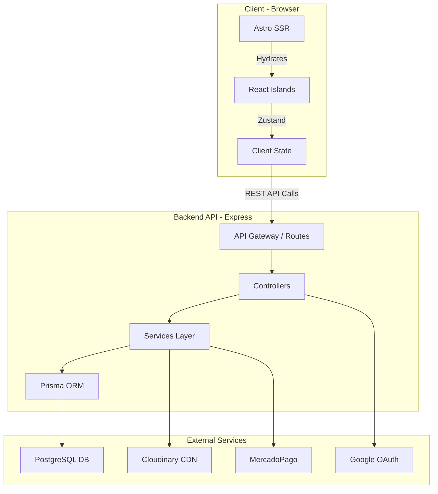

## Introduction

PC Fix is a modern full-stack e-commerce platform built for selling PC hardware and components. The architecture follows a **monorepo structure** using NPM Workspaces, enabling efficient code sharing and unified development workflows.

<Note>
This is a production-ready SaaS application deployed on Vercel (frontend) and Railway (backend + database).
</Note>

## High-Level Architecture

The system consists of three main layers:

<CardGroup cols={3}>
  <Card title="Frontend" icon="browser" href="/architecture/frontend">
    Astro 5 with React islands for optimal performance
  </Card>
  <Card title="Backend API" icon="server" href="/architecture/backend">
    Express 5 REST API with modular architecture
  </Card>
  <Card title="Database" icon="database" href="/architecture/database">
    PostgreSQL with Prisma ORM
  </Card>
</CardGroup>

## System Architecture Diagram

## Technology Stack

### Frontend Stack

<AccordionGroup>
  <Accordion title="Core Technologies">
    - **Astro 5.16.3** - Meta-framework for SSR and static generation
    - **React 18.3** - UI library for interactive islands
    - **Tailwind CSS 3.4** - Utility-first CSS framework
    - **TypeScript 5.9** - Type safety across the codebase
  </Accordion>

  <Accordion title="State & Forms">
    - **Zustand 5.0** - Lightweight state management
    - **React Hook Form 7.67** - Performant form handling
    - **Zod 3.25** - Schema validation
  </Accordion>

  <Accordion title="UI & Interactions">
    - **Lucide React** - Icon library
    - **Swiper 11.1** - Touch-enabled carousels
    - **Recharts 3.5** - Data visualization
    - **Sonner 2.0** - Toast notifications
  </Accordion>
</AccordionGroup>

### Backend Stack

<AccordionGroup>
  <Accordion title="Core Technologies">
    - **Express 5.2.1** - Web application framework
    - **Prisma 6.18** - Next-generation ORM
    - **PostgreSQL** - Relational database
    - **TypeScript 5.9** - Type-safe backend code
  </Accordion>

  <Accordion title="Security & Auth">
    - **JWT (jsonwebtoken 9.0.2)** - Stateless authentication
    - **Bcrypt 3.0.3** - Password hashing
    - **Helmet 8.1** - HTTP header security
    - **CORS 2.8** - Cross-origin resource sharing
    - **Express Rate Limit 8.2** - Rate limiting protection
  </Accordion>

  <Accordion title="Integrations">
    - **Cloudinary 2.8** - Image CDN
    - **MercadoPago 2.11** - Payment gateway
    - **Google Auth Library 10.5** - OAuth integration
    - **Resend 6.6** - Transactional email
    - **Node-cron 4.2** - Background job scheduler
  </Accordion>
</AccordionGroup>

## Key Features

<Steps>
  <Step title="Extreme Performance">
    95+ Lighthouse score thanks to Astro's partial hydration and View Transitions
  </Step>
  
  <Step title="Real Inventory Management">
    Automated stock alerts, product tracking, and soft delete functionality
  </Step>
  
  <Step title="Hybrid Payment Gateway">
    Native MercadoPago integration, cryptocurrency (USDT), and offline payments
  </Step>
  
  <Step title="Comprehensive Admin Dashboard">
    Full CRUD operations, analytics, charts, and support ticket management
  </Step>
  
  <Step title="Authentication & Authorization">
    JWT-based auth with Google OAuth, role-based access control (USER/ADMIN)
  </Step>
</Steps>

## Deployment Architecture

<CardGroup cols={2}>
  <Card title="Frontend Deployment" icon="vercel">
    - **Platform**: Vercel
    - **Features**: Edge functions, preview deployments
    - **CDN**: Global edge network
    - **Analytics**: Built-in web analytics
  </Card>
  
  <Card title="Backend Deployment" icon="cloud">
    - **Platform**: Railway
    - **Services**: API + PostgreSQL database
    - **Monitoring**: Sentry error tracking
    - **Scaling**: Automatic container scaling
  </Card>
</CardGroup>

## Development Workflow

<Tip>
The monorepo structure allows for:
- **Shared TypeScript types** between frontend and backend
- **Unified dependency management** with NPM Workspaces
- **Consistent testing setup** with Vitest across packages
- **Docker Compose** for local development environment
</Tip>

### Development Ports

| Service | Port | URL |
|---------|------|-----|
| Frontend (Astro) | 4321 | http://localhost:4321 |
| Backend API | 3002 | http://localhost:3002 |
| Prisma Studio | 5555 | http://localhost:5555 |

## Testing Strategy

<CardGroup cols={2}>
  <Card title="Unit Testing" icon="flask">
    **Vitest 4.0** for fast unit and integration tests
    - Component testing with @testing-library/react
    - Store testing with vitest-mock-extended
    - Backend service testing
  </Card>
  
  <Card title="E2E Testing" icon="robot">
    **Playwright 1.57** for end-to-end testing
    - Critical user flows (checkout, login)
    - Visual regression testing
    - Cross-browser compatibility
  </Card>
</CardGroup>

## Monitoring & Observability

<Steps>
  <Step title="Error Tracking">
    Sentry integration on both frontend and backend for real-time error monitoring
  </Step>
  
  <Step title="Request Logging">
    Morgan middleware for HTTP request logging in development
  </Step>
  
  <Step title="Database Monitoring">
    Health check endpoint at `/health` for database connectivity verification
  </Step>
  
  <Step title="Performance Metrics">
    Vercel Web Analytics for frontend performance tracking
  </Step>
</Steps>

## Next Steps

<CardGroup cols={2}>
  <Card title="Monorepo Structure" icon="folder-tree" href="/architecture/monorepo">
    Explore the NPM Workspace setup
  </Card>
  <Card title="Frontend Architecture" icon="browser" href="/architecture/frontend">
    Learn about Astro and React integration
  </Card>
  <Card title="Backend Architecture" icon="server" href="/architecture/backend">
    Dive into the Express API structure
  </Card>
  <Card title="Database Schema" icon="database" href="/architecture/database">
    Understand the data model
  </Card>
</CardGroup>