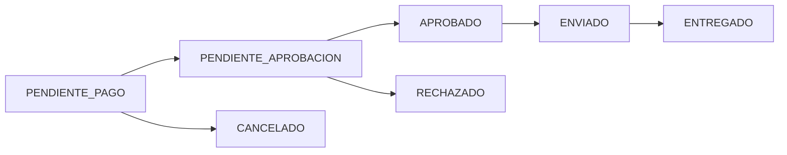

## Overview

PC Fix implements a flexible payment system that accepts multiple payment methods to maximize customer convenience and conversion rates. The platform supports online payments through MercadoPago, cryptocurrency payments via USDT, and traditional offline payment methods.

## Supported Payment Methods

<CardGroup cols={3}>
  <Card title="MercadoPago" icon="credit-card">
    Credit/debit cards and digital wallet payments
  </Card>
  <Card title="USDT Crypto" icon="bitcoin">
    Tether (USDT) cryptocurrency via Binance
  </Card>
  <Card title="Bank Transfer" icon="building-columns">
    Traditional wire transfer with proof of payment
  </Card>
  <Card title="Cash" icon="money-bill">
    Cash on delivery or at pickup location
  </Card>
  <Card title="Viumi" icon="wallet">
    Alternative digital payment platform
  </Card>
  <Card title="Offline" icon="receipt">
    Manual payment verification by admin
  </Card>
</CardGroup>

## MercadoPago Integration

### Payment Preference Creation

MercadoPago is integrated as the primary online payment gateway. The system creates payment preferences with order details:

```typescript packages/api/src/shared/services/MercadoPagoService.ts
import { MercadoPagoConfig, Preference } from 'mercadopago';

export class MercadoPagoService {
  private client: MercadoPagoConfig;
  private preference: Preference;

  constructor() {
    const accessToken = process.env.MP_ACCESS_TOKEN;
    this.client = new MercadoPagoConfig({ accessToken: accessToken || '' });
    this.preference = new Preference(this.client);
  }

  async createPreference(saleId: number, items: any[], payerEmail: string, shipmentCost?: number) {
    const mpItems = items.map(item => ({
      ...item,
      title: item.title
    }));

    // Add shipping cost as separate line item
    if (shipmentCost && shipmentCost > 0) {
      mpItems.push({
        id: 'shipping',
        title: 'Costo de envio',
        quantity: 1,
        unit_price: shipmentCost,
        currency_id: 'ARS'
      });
    }

    const backendUrl = process.env.API_URL ||
      (process.env.RAILWAY_PUBLIC_DOMAIN ? `https://${process.env.RAILWAY_PUBLIC_DOMAIN}` : 'http://localhost:3002');
    const successUrl = `${backendUrl}/api/sales/mp-callback?external_reference=${saleId}`;

    const isProduction = backendUrl.includes('https') && !backendUrl.includes('localhost');
    const notificationUrl = isProduction ? `${backendUrl}/api/sales/webhook` : undefined;

    const body: any = {
      items: mpItems,
      external_reference: String(saleId),
      back_urls: {
        success: successUrl,
        failure: successUrl,
        pending: successUrl
      },
    };

    if (notificationUrl) {
      body.notification_url = notificationUrl;
    }

    const result = await this.preference.create({ body });
    return result.init_point;
  }
}
```

### Webhook Processing

MercadoPago sends webhook notifications when payment status changes. The system processes these automatically:

```typescript packages/api/src/modules/sales/sales.service.ts
async processMPWebhook(paymentId: string) {
  const mpService = new MercadoPagoService();
  const payment = await mpService.getPayment(paymentId);

  if (payment.status === 'approved' && payment.external_reference) {
    const saleId = Number(payment.external_reference);
    const sale = await prisma.venta.findUnique({ where: { id: saleId } });

    // Only update if not already approved
    if (sale && sale.estado !== VentaEstado.APROBADO) {
      await this.updateStatus(saleId, VentaEstado.APROBADO);
      await this.updatePaymentMethod(saleId, 'MERCADOPAGO');
    }
  }
}
```

<Info>
Webhooks are only configured in production environments to prevent issues during local development.
</Info>

## Dynamic Pricing

### Payment Method Discounts

PC Fix offers an 8% discount for payments made outside of MercadoPago to offset transaction fees:

```typescript packages/api/src/modules/sales/sales.service.ts
for (const item of items) {
  const dbProduct = dbProducts.find((p: any) => p.id === Number(item.id));
  if (!dbProduct) throw new Error(`Producto ${item.id} no encontrado`);

  // Apply 8% discount for non-MercadoPago payments
  let precio = Number(dbProduct.precio);
  if (medioPago !== 'MERCADOPAGO') {
    precio = precio * 0.92;
  }

  subtotalReal += precio * item.quantity;

  lineasParaCrear.push({
    productoId: dbProduct.id,
    cantidad: item.quantity,
    subTotal: precio * item.quantity
  });
}
```

### Payment Method Updates

Customers can change their payment method before completing payment. Prices are recalculated automatically:

```typescript packages/api/src/modules/sales/sales.service.ts
async updatePaymentMethod(saleId: number, medioPago: string) {
  const sale = await prisma.venta.findUnique({
    where: { id: saleId },
    include: { lineasVenta: { include: { producto: true } } }
  });

  if (!sale) throw new Error('Venta no encontrada');

  let newSubtotal = 0;
  const updateLinesPromises = sale.lineasVenta.map(line => {
    let unitPrice = Number(line.producto.precio);

    // Apply discount for non-MercadoPago payments
    if (medioPago !== 'MERCADOPAGO') {
      unitPrice = unitPrice * 0.92;
    }

    const newLineSubtotal = unitPrice * line.cantidad;
    newSubtotal += newLineSubtotal;

    return prisma.lineaVenta.update({
      where: { id: line.id },
      data: { subTotal: newLineSubtotal }
    });
  });

  const newTotal = newSubtotal + Number(sale.costoEnvio || 0);

  return await prisma.$transaction([
    ...updateLinesPromises,
    prisma.venta.update({
      where: { id: saleId },
      data: {
        medioPago,
        montoTotal: newTotal
      },
      include: { lineasVenta: { include: { producto: true } } }
    })
  ]).then(results => results[results.length - 1]);
}
```

<Warning>
Changing payment methods recalculates all line item prices and the total order amount. This happens in a database transaction to ensure consistency.
</Warning>

## Cryptocurrency Payments (USDT)

### Dynamic Exchange Rate

PC Fix accepts USDT (Tether) cryptocurrency payments. The exchange rate is automatically updated every 4 hours:

```typescript packages/api/src/shared/services/cron.service.ts
start() {
  // Update USDT exchange rate every 4 hours
  cron.schedule('0 */4 * * *', async () => {
    try {
      const result = await configService.syncUsdtPrice();
      if (!result) {
        console.warn('Cron: No se pudo obtener la cotización');
      }
    } catch (error) {
      console.error('Cron Error: No se pudo actualizar USDT', error);
    }
  });
}
```

### USDT Configuration

The system stores USDT payment information in the configuration:

```prisma packages/api/prisma/schema.prisma
model Configuracion {
  id              Int     @id @default(autoincrement())
  cotizacionUsdt  Decimal @default(1150) @db.Decimal(10, 2)
  binanceAlias    String? @default("PCFIX.USDT")
  binanceCbu      String? @default("PAY-ID-123456")
  // ... other fields
}
```

## Bank Transfer Payments

### Bank Account Information

For traditional bank transfers, the system displays account details stored in configuration:

```prisma packages/api/prisma/schema.prisma
model Configuracion {
  nombreBanco     String  @default("Banco Nación")
  titular         String  @default("PCFIX S.A.")
  cbu             String  @default("0000000000000000000000")
  alias           String  @default("PCFIX.VENTAS")
  // ... other fields
}
```

### Payment Receipt Upload

Customers upload proof of payment which triggers admin review:

```typescript packages/api/src/modules/sales/sales.service.ts
async uploadReceipt(saleId: number, receiptUrl?: string) {
  const dataToUpdate: any = { estado: VentaEstado.PENDIENTE_APROBACION };
  if (receiptUrl) dataToUpdate.comprobante = receiptUrl;
  
  const updated = await prisma.venta.update({ 
    where: { id: saleId }, 
    data: dataToUpdate, 
    include: { cliente: { include: { user: true } } } 
  });
  
  if (updated.cliente?.user?.email) {
    this.emailService.sendNewReceiptNotification(saleId, updated.cliente.user.email)
      .catch(console.error);
  }
  
  return updated;
}
```

## Viumi Payment Platform

PC Fix also integrates with Viumi as an alternative payment processor:

```typescript packages/api/src/modules/sales/sales.service.ts
async createViumiPreference(saleId: number) {
  const sale = await prisma.venta.findUnique({
    where: { id: saleId },
    include: { 
      cliente: { include: { user: true } }, 
      lineasVenta: { include: { producto: true } } 
    }
  });
  if (!sale) throw new Error("Venta no encontrada");

  const callbackUrl = `${process.env.APP_URL || 'http://localhost:4321'}/checkout/viumi-success`;

  const items = sale.lineasVenta.map((line: any) => ({
    nombre: line.producto.nombre,
    cantidad: line.cantidad,
    precio: Number(line.subTotal) / line.cantidad
  }));

  // Add shipping as line item
  if (Number(sale.costoEnvio) > 0) {
    items.push({
      nombre: "Envío",
      cantidad: 1,
      precio: Number(sale.costoEnvio)
    });
  }

  const viumiService = new (require('../../shared/services/ViumiService').ViumiService)();
  return await viumiService.createPaymentPreference(sale, items, callbackUrl);
}
```

## Order Status Flow

### Payment States



```prisma packages/api/prisma/schema.prisma
enum VentaEstado {
  PENDIENTE_PAGO
  PENDIENTE_APROBACION
  APROBADO
  ENVIADO
  ENTREGADO
  RECHAZADO
  CANCELADO
}
```

### Status Updates

When order status changes, customers receive email notifications:

```typescript packages/api/src/modules/sales/sales.service.ts
async updateStatus(saleId: number, status: VentaEstado) {
  const sale = await prisma.venta.findUnique({
    where: { id: saleId },
    include: { lineasVenta: true, cliente: { include: { user: true } } }
  });
  if (!sale) throw new Error("Venta no encontrada");

  const result = await prisma.$transaction(async (tx: any) => {
    // Restore stock if order rejected or cancelled
    if (status === VentaEstado.RECHAZADO || status === VentaEstado.CANCELADO) {
      for (const linea of sale.lineasVenta) {
        const prod = await tx.producto.findUnique({ where: { id: linea.productoId } });
        if (prod && prod.stock < 90000) {
          await tx.producto.update({
            where: { id: linea.productoId },
            data: { stock: { increment: linea.cantidad } }
          });
        }
      }
    }

    return await tx.venta.update({
      where: { id: saleId },
      data: { estado: status },
      include: { cliente: { include: { user: true } } }
    });
  });

  if (result.cliente?.user?.email) {
    this.emailService.sendStatusUpdate(
      result.cliente.user.email, 
      saleId, 
      status, 
      result.tipoEntrega
    ).catch(console.error);
  }
  return result;
}
```

<Info>
When orders are rejected or cancelled, inventory is automatically restored in a database transaction.
</Info>

## Payment Method Storage

### Database Schema

```prisma packages/api/prisma/schema.prisma
model Venta {
  id                Int         @id @default(autoincrement())
  fecha             DateTime    @default(now())
  montoTotal        Decimal     @db.Decimal(10, 2)
  estado            VentaEstado @default(PENDIENTE_PAGO)
  comprobante       String?     // Payment receipt URL
  medioPago         String      @default("TRANSFERENCIA")
  // ... other fields
}
```

The `medioPago` field stores the selected payment method:
- `MERCADOPAGO` - MercadoPago payments
- `TRANSFERENCIA` - Bank transfer
- `BINANCE` - USDT cryptocurrency
- `EFECTIVO` - Cash payment

## Security Considerations

<CardGroup cols={2}>
  <Card title="Webhook Verification" icon="shield-check">
    MercadoPago webhooks verified before processing
  </Card>
  <Card title="Receipt Validation" icon="file-check">
    Payment receipts reviewed by admin before approval
  </Card>
  <Card title="Transaction Safety" icon="lock">
    All payment operations use database transactions
  </Card>
  <Card title="Stock Protection" icon="box">
    Stock decremented only after payment confirmation
  </Card>
</CardGroup>

## Environment Variables

Required environment variables for payment processing:

```bash
MP_ACCESS_TOKEN=your-mercadopago-access-token
API_URL=https://api.yoursite.com
APP_URL=https://yoursite.com
RAILWAY_PUBLIC_DOMAIN=your-railway-domain.railway.app
```

## API Endpoints

| Endpoint | Method | Description |
|----------|--------|-------------|
| `/api/sales` | POST | Create new sale with payment method |
| `/api/sales/:id/payment-method` | PUT | Update payment method |
| `/api/sales/:id/receipt` | POST | Upload payment receipt |
| `/api/sales/webhook` | POST | MercadoPago webhook handler |
| `/api/sales/mp-callback` | GET | MercadoPago payment callback |
| `/api/sales/:id/viumi-preference` | POST | Create Viumi payment |

<Tip>
The 8% discount for non-MercadoPago payments helps offset the cost of payment processor fees while incentivizing direct payment methods.
</Tip>