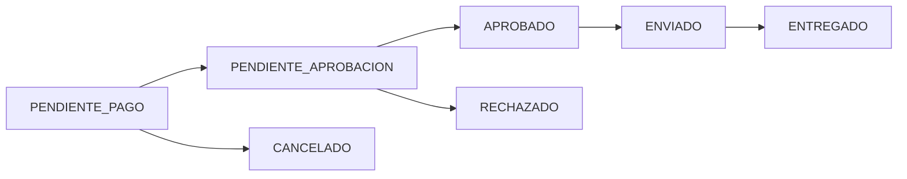

## Overview

PC Fix supports cryptocurrency payments using USDT (Tether) through Binance. The platform automatically syncs USDT/ARS exchange rates and provides customers with payment instructions for direct transfers.

<Note>
  Crypto payments are manual transfers that require admin approval after receipt upload. This is different from automated payment gateways like MercadoPago.
</Note>

## Payment Methods

PC Fix supports two crypto payment methods:

- **BINANCE**: Direct transfer via Binance Pay or P2P
- **TRANSFERENCIA**: Traditional bank transfer (included here for comparison)

## Environment Configuration

The crypto payment system requires these configuration fields in the database:

```typescript
// Database schema (Prisma)
model Configuracion {
  id               Int      @id @default(autoincrement())
  binanceAlias     String?  // Binance Pay alias
  binanceCbu       String?  // Binance P2P CBU
  cotizacionUsdt   Decimal? // Current USDT/ARS rate
  // ... other fields
}
```

### Configuration Storage

Store Binance payment details in your system configuration:

```bash
POST /api/config
```

```json
{
  "binanceAlias": "PCFIX.CRYPTO",
  "binanceCbu": "0000003100012345678901",
  "cotizacionUsdt": 1250.50
}
```

## USDT Price Synchronization

### Automatic Sync

PC Fix automatically syncs USDT prices every 4 hours using a cron job:

```typescript
// packages/api/src/shared/services/cron.service.ts
export class CronService {
    private configService: ConfigService;

    start() {
        // Sync USDT price every 4 hours
        cron.schedule('0 */4 * * *', async () => {
            try {
                await this.configService.syncUsdtPrice();
                console.log('✅ USDT price synced successfully');
            } catch (error) {
                console.error('❌ Cron Error: No se pudo actualizar USDT', error);
            }
        });
    }
}
```

### CryptoService Implementation

The `CryptoService` fetches live rates from Binance API:

```typescript
// packages/api/src/shared/services/CryptoService.ts
import axios from 'axios';

export class CryptoService {
    async getUsdtPrice(): Promise<number> {
        try {
            const response = await axios.get(
                'https://api.binance.com/api/v3/ticker/price?symbol=USDTARS'
            );

            if (response.data && response.data.price) {
                return Math.ceil(parseFloat(response.data.price));
            }

            throw new Error('Formato de respuesta inválido');
        } catch (error) {
            console.error("🔥 Error conectando con Binance:", error);
            throw new Error("No se pudo obtener la cotización. Intente manual.");
        }
    }
}
```

### Manual Sync Endpoint

Admins can manually trigger a price update:

```typescript
// packages/api/src/modules/config/config.controller.ts
export const syncUsdt = async (req: Request, res: Response) => {
    try {
        const price = await cryptoService.getUsdtPrice();

        const updated = await prisma.configuracion.update({
            where: { id: 1 },
            data: { cotizacionUsdt: price }
        });

        res.json({
            success: true,
            data: updated,
            message: `Cotización actualizada a $${price} ARS`
        });
    } catch (e: any) {
        console.error("Error sync:", e);
        res.status(500).json({ 
            success: false, 
            error: e.message || "Error conectando con Binance" 
        });
    }
};
```

## Creating Sales with Crypto

When creating a sale, customers can select `BINANCE` as the payment method:

<Steps>
  <Step title="Create Sale Request">
    ```typescript
    const createSaleSchema = z.object({
        items: z.array(z.object({
            id: z.string().or(z.number()),
            quantity: z.number().min(1)
        })).min(1),
        subtotal: z.number().min(0),
        cpDestino: z.string().min(4).optional(),
        tipoEntrega: z.enum(['ENVIO', 'RETIRO']),
        medioPago: z.enum([
            'MERCADOPAGO', 
            'EFECTIVO', 
            'VIUMI', 
            'TRANSFERENCIA', 
            'BINANCE' // Crypto payment
        ]),
        // ... other fields
    });
    ```
  </Step>

  <Step title="Price Calculation">
    Crypto payments receive an 8% discount compared to MercadoPago:

    ```typescript
    let precio = Number(dbProduct.precio);
    if (medioPago !== 'MERCADOPAGO') {
        precio = precio * 0.92; // 8% discount
    }
    ```
  </Step>

  <Step title="Sale Creation">
    The sale is created with `PENDIENTE_PAGO` status:

    ```typescript
    const venta = await tx.venta.create({
        data: {
            cliente: { connect: { id: cliente!.id } },
            montoTotal: subtotalReal + costoEnvio,
            costoEnvio,
            tipoEntrega,
            medioPago: 'BINANCE',
            estado: VentaEstado.PENDIENTE_PAGO,
            lineasVenta: { create: lineasParaCrear },
            // ... shipping details
        },
        include: { lineasVenta: true }
    });
    ```
  </Step>
</Steps>

## Payment Workflow

<Steps>
  <Step title="Customer Selects Crypto Payment">
    Customer chooses BINANCE as payment method during checkout.
  </Step>

  <Step title="View Payment Instructions">
    Customer receives payment instructions showing:
    - Total amount in ARS
    - Equivalent amount in USDT (calculated using `cotizacionUsdt`)
    - Binance Pay alias or CBU
    - Sale ID for reference
  </Step>

  <Step title="Customer Makes Transfer">
    Customer transfers USDT through:
    - Binance Pay (using alias)
    - Binance P2P (using CBU)
    - Direct wallet transfer
  </Step>

  <Step title="Upload Receipt">
    Customer uploads proof of payment:

    ```typescript
    export const uploadReceipt = async (req: Request, res: Response) => {
        const { id } = req.params;
        let receiptUrl = undefined;
        
        const reqAny = req as any;
        if (reqAny.file) {
            receiptUrl = reqAny.file.path;
        }

        const updated = await service.uploadReceipt(
            Number(id), 
            receiptUrl
        );
        res.json({ success: true, data: updated });
    };
    ```
  </Step>

  <Step title="Admin Approval">
    After receipt upload, sale status changes to `PENDIENTE_APROBACION`. Admin reviews and approves:

    ```typescript
    async uploadReceipt(saleId: number, receiptUrl?: string) {
        const dataToUpdate: any = { 
            estado: VentaEstado.PENDIENTE_APROBACION 
        };
        if (receiptUrl) dataToUpdate.comprobante = receiptUrl;
        
        const updated = await prisma.venta.update({
            where: { id: saleId },
            data: dataToUpdate,
            include: { cliente: { include: { user: true } } }
        });
        
        // Send notification email to admin
        if (updated.cliente?.user?.email) {
            this.emailService.sendNewReceiptNotification(
                saleId, 
                updated.cliente.user.email
            ).catch(console.error);
        }
        return updated;
    }
    ```
  </Step>

  <Step title="Status Update">
    Admin updates status to `APROBADO` to confirm payment:

    ```typescript
    await service.updateStatus(saleId, VentaEstado.APROBADO);
    ```
  </Step>
</Steps>

## API Endpoints

<CodeGroup>
```bash GET /api/config
# Get current configuration including USDT rate
curl https://api.example.com/api/config
```

```bash POST /api/config/sync-usdt
# Manually sync USDT price (admin only)
curl -X POST https://api.example.com/api/config/sync-usdt \
  -H "Authorization: Bearer ADMIN_TOKEN"
```

```bash POST /api/sales
# Create sale with crypto payment
curl -X POST https://api.example.com/api/sales \
  -H "Authorization: Bearer USER_TOKEN" \
  -H "Content-Type: application/json" \
  -d '{
    "items": [{"id": 1, "quantity": 2}],
    "subtotal": 50000,
    "tipoEntrega": "ENVIO",
    "medioPago": "BINANCE"
  }'
```

```bash POST /api/sales/:id/receipt
# Upload payment receipt
curl -X POST https://api.example.com/api/sales/123/receipt \
  -H "Authorization: Bearer USER_TOKEN" \
  -F "file=@receipt.jpg"
```

```bash PATCH /api/sales/:id/status
# Update sale status (admin only)
curl -X PATCH https://api.example.com/api/sales/123/status \
  -H "Authorization: Bearer ADMIN_TOKEN" \
  -H "Content-Type: application/json" \
  -d '{"status": "APROBADO"}'
```
</CodeGroup>

## Updating Payment Method

Customers can switch between payment methods before completing payment:

```typescript
export const updatePaymentMethod = async (req: Request, res: Response) => {
    const { id } = req.params;
    const { medioPago } = req.body;

    if (!['TRANSFERENCIA', 'BINANCE', 'EFECTIVO', 'MERCADOPAGO', 'VIUMI'].includes(medioPago)) {
        return res.status(400).json({ 
            success: false, 
            error: 'Medio de pago inválido' 
        });
    }

    const updated = await service.updatePaymentMethod(
        Number(id), 
        medioPago
    );
    res.json({ success: true, data: updated });
};
```

### Price Recalculation

When switching payment methods, prices are recalculated:

```typescript
async updatePaymentMethod(saleId: number, medioPago: string) {
    const sale = await prisma.venta.findUnique({
        where: { id: saleId },
        include: { lineasVenta: { include: { producto: true } } }
    });

    let newSubtotal = 0;
    const updateLinesPromises = sale.lineasVenta.map(line => {
        let unitPrice = Number(line.producto.precio);

        // Apply discount for non-MercadoPago payments
        if (medioPago !== 'MERCADOPAGO') {
            unitPrice = unitPrice * 0.92;
        }

        const newLineSubtotal = unitPrice * line.cantidad;
        newSubtotal += newLineSubtotal;

        return prisma.lineaVenta.update({
            where: { id: line.id },
            data: { subTotal: newLineSubtotal }
        });
    });

    const newTotal = newSubtotal + Number(sale.costoEnvio || 0);

    return await prisma.$transaction([
        ...updateLinesPromises,
        prisma.venta.update({
            where: { id: saleId },
            data: {
                medioPago,
                montoTotal: newTotal
            },
            include: { lineasVenta: { include: { producto: true } } }
        })
    ]).then(results => results[results.length - 1]);
}
```

## Sale Status Workflow

Crypto payments follow this status progression:



### Status Descriptions

- **PENDIENTE_PAGO**: Waiting for customer to make payment
- **PENDIENTE_APROBACION**: Receipt uploaded, awaiting admin verification
- **APROBADO**: Payment confirmed by admin
- **RECHAZADO**: Payment rejected (invalid receipt or amount mismatch)
- **ENVIADO**: Order shipped to customer
- **ENTREGADO**: Order delivered
- **CANCELADO**: Order cancelled by customer or admin

## Calculating USDT Amount

To display the USDT equivalent to customers:

```typescript
// Get current USDT rate
const config = await prisma.configuracion.findFirst();
const usdtRate = Number(config?.cotizacionUsdt || 0);

// Calculate USDT amount
const totalARS = sale.montoTotal;
const totalUSDT = (totalARS / usdtRate).toFixed(2);

console.log(`Total: $${totalARS} ARS = ${totalUSDT} USDT`);
```

## Alternative: CriptoYa Integration

The platform also includes an alternative sync method using CriptoYa API:

```typescript
// packages/api/src/modules/config/config.service.ts
async syncUsdtPrice() {
    try {
        const response = await axios.get(
            'https://criptoya.com/api/usdt/ars/0.1'
        );

        const price = response.data.binancep2p?.ask;

        if (!price || isNaN(price)) {
            throw new Error("Precio inválido recibido de CriptoYa");
        }

        const precioFinal = Number(Number(price).toFixed(2));

        const config = await prisma.configuracion.findFirst();
        if (config) {
            const updated = await prisma.configuracion.update({
                where: { id: config.id },
                data: { cotizacionUsdt: precioFinal }
            });
            return updated;
        }
        return null;
    } catch (error) {
        console.error("Error obteniendo cotización P2P:", error);
        throw new Error("No se pudo obtener la cotización externa");
    }
}
```

## Frontend Integration Example

```typescript
// Display payment instructions to customer
const PaymentInstructions = ({ sale, config }) => {
  const usdtAmount = (sale.montoTotal / config.cotizacionUsdt).toFixed(2);
  
  return (
    <div>
      <h3>Instrucciones de Pago</h3>
      <p>Total: ${sale.montoTotal} ARS</p>
      <p>Equivalente: {usdtAmount} USDT</p>
      <p>Alias: {config.binanceAlias}</p>
      <p>CBU: {config.binanceCbu}</p>
      <p>Referencia: Orden #{sale.id}</p>
      
      <button onClick={uploadReceipt}>
        Subir Comprobante
      </button>
    </div>
  );
};
```

## Best Practices

<Note>
  **Price Sync Frequency**: USDT prices are synced every 4 hours. For volatile markets, consider increasing frequency.
</Note>

<Warning>
  Always verify the transferred USDT amount matches the expected amount before approving orders. Use the `cotizacionUsdt` at the time of sale creation.
</Warning>

### Security Considerations

- Store Binance credentials securely in database, never in code
- Validate receipt images before storing
- Implement rate limiting on sync endpoints
- Log all payment status changes for audit trail
- Verify USDT amounts manually before approval

### User Experience

- Display real-time USDT rates during checkout
- Show clear payment instructions with copy buttons
- Provide receipt upload with image preview
- Send email notifications at each status change
- Include payment deadline (e.g., 24 hours)

## Troubleshooting

**USDT price not syncing:**
- Check Binance API availability
- Verify cron job is running
- Check server timezone settings
- Review error logs for API issues

**Receipt upload fails:**
- Check file upload middleware configuration
- Verify storage path exists and is writable
- Check file size limits
- Ensure correct file types are accepted

**Amount mismatches:**
- Always use the USDT rate at sale creation time
- Store rate in sale record for reference
- Display rate used when showing payment instructions
- Account for Binance fees in calculations

## Additional Resources

- [Binance API Documentation](https://binance-docs.github.io/apidocs/spot/en/)
- [CriptoYa API Docs](https://criptoya.com/api)
- [USDT (Tether) Official Site](https://tether.to/)
- [Binance P2P Trading Guide](https://www.binance.com/en/support/faq/p2p)