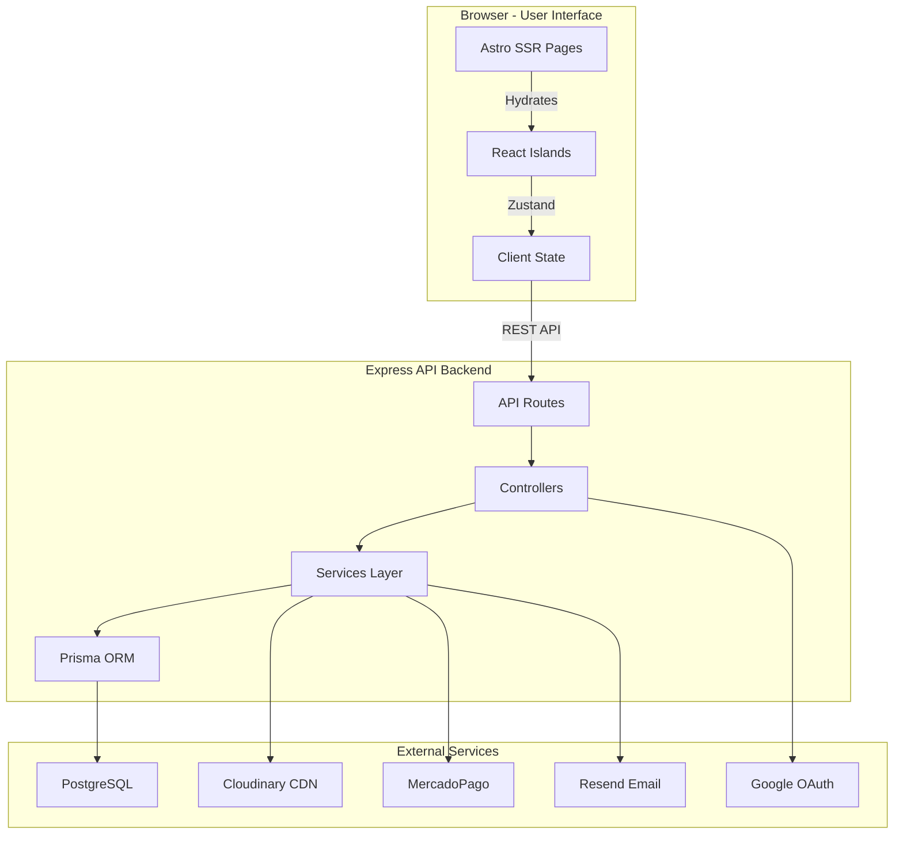

# Welcome to PC Fix

PC Fix is a comprehensive e-commerce platform built for selling PC hardware and providing technical services. Built on a modern monorepo architecture, PC Fix delivers exceptional performance (95+ Lighthouse score) while maintaining a seamless user experience.

<Note>
PC Fix is a full-stack SaaS solution combining the speed of Astro Server Islands with the interactivity of React, backed by a robust Express API and PostgreSQL database.
</Note>

## What is PC Fix?

PC Fix is more than just an online store - it's a complete e-commerce solution designed to scale. The platform orchestrates a robust API and a cutting-edge hybrid frontend, providing:

- **Lightning-fast shopping experience** with Astro SSR and ViewTransitions
- **Real-time inventory management** with automatic stock alerts
- **Hybrid payment gateway** supporting MercadoPago, crypto (USDT), and offline payments
- **Comprehensive admin dashboard** with metrics, analytics, and full CRUD operations

## Who is PC Fix for?

<CardGroup cols={2}>
  <Card title="E-commerce Businesses" icon="store">
    Perfect for businesses selling PC hardware and electronics with complex inventory needs
  </Card>
  <Card title="Technical Service Providers" icon="wrench">
    Built-in technical consultation system for customer support and service requests
  </Card>
  <Card title="Developers" icon="code">
    Modern tech stack with TypeScript, Prisma ORM, and comprehensive testing suite
  </Card>
  <Card title="Startups" icon="rocket">
    Production-ready with Docker, CI/CD, monitoring, and cloud deployment support
  </Card>
</CardGroup>

## Key Capabilities

### Performance-First Architecture

PC Fix achieves exceptional performance through:

- **Astro 5 Server Islands**: Selective hydration for optimal load times
- **React 18 Islands**: Interactive components only where needed (cart, checkout, forms)
- **Image Optimization**: Cloudinary CDN integration with automatic optimization
- **ViewTransitions**: Smooth page transitions without full reloads

### Comprehensive Feature Set

<AccordionGroup>
  <Accordion title="Product Management">
    - Advanced product catalog with categories and brands
    - Real-time inventory tracking with low stock alerts
    - Multi-image support with Cloudinary CDN
    - Product favorites and user wishlists
    - Automatic detection of inactive products
  </Accordion>

  <Accordion title="Shopping Experience">
    - Persistent shopping cart with Zustand state management
    - Guest and authenticated checkout flows
    - Multiple payment methods (MercadoPago, crypto, offline)
    - Order tracking and history
    - Abandoned cart recovery via email
  </Accordion>

  <Accordion title="User Management">
    - JWT-based authentication with refresh tokens
    - Google OAuth integration for social login
    - Role-based access control (USER, ADMIN)
    - Password reset with email verification
    - User profiles with address management
  </Accordion>

  <Accordion title="Admin Dashboard">
    - Real-time sales metrics and analytics
    - Interactive charts with Recharts
    - Complete CRUD operations for products, users, and orders
    - Banner and promotion management
    - Technical consultation management
    - Inventory alerts and reporting
  </Accordion>

  <Accordion title="Technical Services">
    - Customer consultation request system
    - Service tracking and management
    - Technical support integration
    - Custom service offerings
  </Accordion>
</AccordionGroup>

## Technology Stack

PC Fix is built on a modern, production-ready stack:

### Frontend (`packages/web`)

- **Astro 5.16**: Hybrid rendering (SSR + Static) with file-based routing
- **React 18.3**: Interactive islands for cart, checkout, and admin features
- **Tailwind CSS 3.4**: Utility-first styling with responsive design
- **Zustand 5.0**: Lightweight global state management
- **React Hook Form 7.67**: Performant form handling with validation
- **Zod 3.25**: Type-safe schema validation
- **Recharts 3.5**: Data visualization for admin dashboard
- **Lucide React**: Consistent icon library
- **Swiper 11.1**: Touch-enabled product carousels

### Backend (`packages/api`)

- **Express 5.2**: Modern async/await API server
- **Prisma 6.18**: Type-safe ORM with PostgreSQL
- **PostgreSQL**: Robust relational database
- **JWT 9.0**: Stateless authentication with refresh tokens
- **Bcrypt**: Secure password hashing
- **Helmet & CORS**: Security best practices
- **Express Rate Limit**: Brute force protection
- **Multer**: File upload handling
- **Node-cron**: Background job scheduler

### Cloud Services & Infrastructure

- **Cloudinary**: CDN for image storage and optimization
- **MercadoPago SDK 2.11**: Payment processing integration
- **Google Auth Library**: OAuth 2.0 authentication
- **Resend**: Transactional email service
- **Sentry**: Real-time error monitoring (frontend & backend)
- **Docker & Docker Compose**: Containerized development and deployment
- **Vercel**: Frontend hosting with edge functions
- **Railway**: Backend and PostgreSQL hosting

### Testing & Quality

- **Vitest 4.0**: Lightning-fast unit testing
- **Playwright**: End-to-end testing for critical flows
- **TypeScript 5.9**: Full type safety across the monorepo

## Architecture Overview

## Development Philosophy

PC Fix is built with these core principles:

1. **Performance First**: Every architectural decision prioritizes speed and user experience
2. **Type Safety**: TypeScript and Zod schemas ensure reliability across the stack
3. **Scalability**: Monorepo structure with clear separation of concerns
4. **Security**: Industry best practices with Helmet, rate limiting, and JWT tokens
5. **Developer Experience**: Hot reload, comprehensive testing, and clear documentation
6. **Production Ready**: Docker containers, monitoring, and cloud deployment configured

## Live Demo

Explore the live platform at [www.pcfixbaru.com.ar](https://www.pcfixbaru.com.ar)

## Next Steps

<CardGroup cols={2}>
  <Card title="Quick Start" icon="rocket" href="/quickstart">
    Get up and running with Docker in under 5 minutes
  </Card>
  <Card title="Installation Guide" icon="download" href="/installation">
    Detailed setup instructions for local development
  </Card>
</CardGroup>